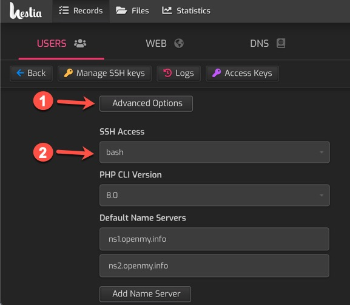

# hestiacp-nodeapp
A plugin for Hestia Control Panel (via [hestiacp-pluginable](https://github.com/steveorevo/hestiacp-pluginable)) that enables hosting generic NodeJS based applications with control via pm2. With this plugin installed, user accounts can host their own NodeJS applications. A simple [Hello World! ExpressJS application](https://expressjs.com/en/starter/hello-world.html) is included as the default NodeApp application.

> :warning: !!! Note: this repo is in progress; when completed, a release will appear in the release tab.

&nbsp;
## Installation
HestiaCP-NodeApp requires an Ubuntu based installation of [Hestia Control Panel](https://hestiacp.com) in addition to an installation of [HestiaCP-Pluginable](https://github.com/steveorevo/hestiacp-pluginable) to function; please ensure that you have first installed pluginable on your Hestia Control Panel before proceeding. Switch to a root user and simply download and unzip this project and move the folder to the `/usr/local/hestia/plugins` folder. It should appear as a subfolder with the name `nodeapp`, i.e. `/usr/local/hestia/plugins/nodeapp`.

Note: It is important that the plugin folder name is `nodeapp`.

```
sudo -s
cd /tmp
wget https://github.com/Steveorevo/hestiacp-nodeapp/archive/refs/heads/main.zip
unzip main.zip
mv hestiacp-nodeapp-main /usr/local/hestia/plugins/nodeapp
rm main.zip
```

Be sure to logout and login again to your Hestia Control Panel; the plugin will immediately start installing NodeJS depedencies in the background. This may take awhile before the options appear in the Hestia. You can force manual installation via root level SSH:

```
sudo -s
cd /usr/local/hestia/plugins/nodeapp
./install
```

&nbsp;
## Using NodaApp to Host a NodeJS Website
The Hestia user account to be associated with a new web domain must have bash SSH access. This is to allow Hestia to switch to their user account to start and stop the NodeJS application. Login as the admin user in Hestia to grant bash SSH Access. Simply edit the Hestia user account; 1) Click the *'Advanced Options'* button after *'Edit User'* and 2) Select `bash` from the combobox under *'SSH Access'*, and save the changes (see image below).

<br><br>

The basic default NodeJS application is the [Hello World! ExpressJS application](https://expressjs.com/en/starter/hello-world.html). To create it, simply select the user account (that has bash SSH access enabled), and add a web domain. Edit the web domain and select the 

This may take a while, but eventually you will have a new Nginx **"Proxy Template"** for NodeApp. 


Add a new web domain and visit the **Advanced Options** section and look for the NodeApp option under You can also install manaully by invoking the installer as a root user:


