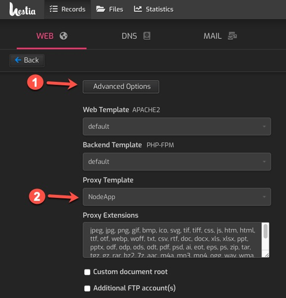

# hestiacp-nodeapp
A plugin for Hestia Control Panel (via [hestiacp-pluginable](https://github.com/steveorevo/hestiacp-pluginable)) that enables hosting generic NodeJS based applications with control via pm2. With this plugin installed, user accounts can host their own NodeJS applications. A simple [Hello World! ExpressJS application](https://expressjs.com/en/starter/hello-world.html) is included as the default NodeApp application.

> :warning: !!! Note: this repo is in progress; when completed, a release will appear in the release tab.

&nbsp;
## Installation
HestiaCP-NodeApp requires an Ubuntu based installation of [Hestia Control Panel](https://hestiacp.com) in addition to an installation of [HestiaCP-Pluginable](https://github.com/steveorevo/hestiacp-pluginable) to function; please ensure that you have first installed pluginable on your Hestia Control Panel before proceeding. Switch to a root user and simply download and unzip this project and move the folder to the `/usr/local/hestia/plugins` folder. It should appear as a subfolder with the name `nodeapp`, i.e. `/usr/local/hestia/plugins/nodeapp`.

Note: It is important that the plugin folder name is `nodeapp`.

```
sudo -s
cd /tmp
wget https://github.com/Steveorevo/hestiacp-nodeapp/archive/refs/heads/main.zip
unzip main.zip
mv hestiacp-nodeapp-main /usr/local/hestia/plugins/nodeapp
rm main.zip
```

Be sure to logout and login again to your Hestia Control Panel; the plugin will immediately start installing NodeJS depedencies in the background. This may take awhile before the options appear in the Hestia. You can force manual installation via root level SSH:

```
sudo -s
cd /usr/local/hestia/plugins/nodeapp
./install
```

&nbsp;
## Using NodaApp to Host a NodeJS Website
The Hestia user account to be associated with a new web domain must have bash SSH access. This is to allow Hestia to switch to their user account to start and stop the NodeJS application. Login as the admin user in Hestia to grant bash SSH Access. Simply edit the Hestia user account; 1) Click the *'Advanced Options'* button after ***'Edit User'*** and 2) Select `bash` from the combobox under ***'SSH Access'***, and save the changes (see image below).

<br><br>

The basic default NodeJS application is the [Hello World! ExpressJS application](https://expressjs.com/en/starter/hello-world.html). To use it, simply select the user account (that has bash SSH access enabled), and add a web domain. Edit the web domain; 1) Click the ***'Advanced Options'*** and 2) Select `NodeApp` in the ***'Proxy Template'*** combobox (if the option is missing, wait for installation to complete or attempt manual installation instructions above).

<br><br>

After saving your changes, you should be able to visit the web domain and see the `Hello World!` text on a white background. The basic NodeJS Express application lives in the `app.js` file which is located in the nodeapp folder. I.e. for the user "johnsmith" on "example.com", the filename path for the application would be at `/home/johnsmith/web/example.com/nodeapp/app.js`. Hestia control panel will automatically stop the NodeJS application when you select a different proxy template for the domain and restart it when you select NodeJS again. Likewise if you delete the domain, Hestia will free the allocated port from the pool of ports on the system and shutdown the NodeJS app prior to deleting the web domain.

With the HestiaCP-NodeApp plugin, you do not need to configure ports, create Ngnix templates, or customize any templates. The plugin will automatically allocate ports for each user account and web domain (as well as clean them up when they are deleted). It will furnish a unique NodeJS instance using an advanced process manager with watch dog, as well as configure Nginx to securely display the app on your designated web domain. Your web development stack will be able to leverage the latest in NodeJS technology, use websockets, and run multiple users and web domains all from the Hestia control panel.
