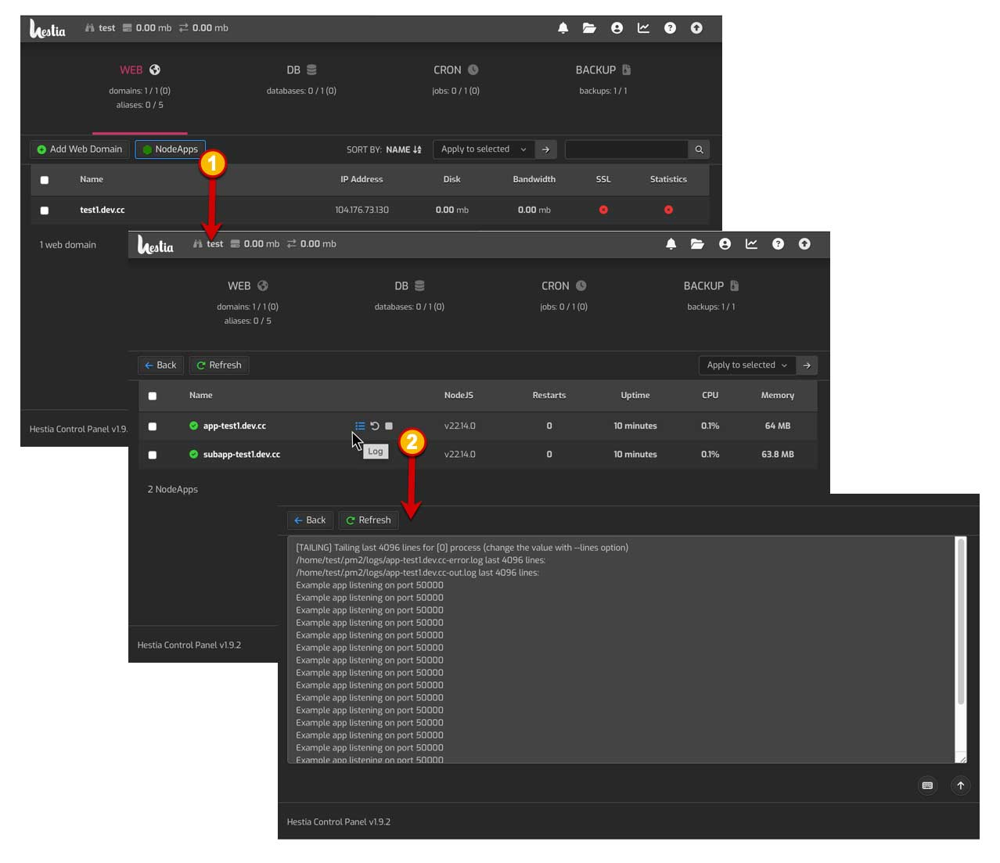
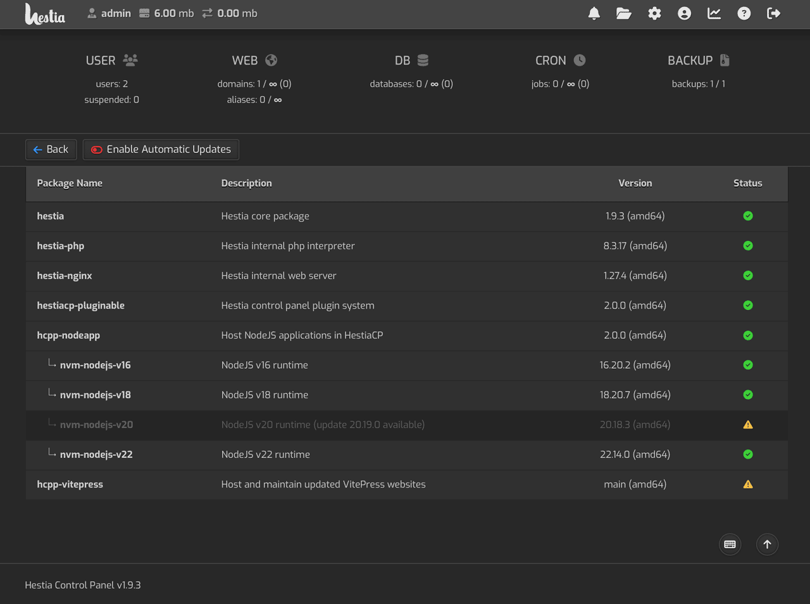
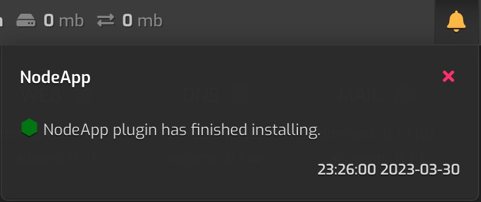

# hcpp-nodeapp
A plugin for Hestia Control Panel (via [hestiacp-pluginable](https://github.com/virtuosoft-dev/hestiacp-pluginable)) that enables hosting generic NodeJS based applications with control via [PM2 (Process Manager)](https://pm2.keymetrics.io). With this plugin installed, user accounts can host their own NodeJS applications. A simple [Hello World! ExpressJS application](https://expressjs.com/en/starter/hello-world.html) is included as the default NodeApp application. [NVM (NodeJS Version Manager)](https://github.com/nvm-sh/nvm) is also included and the default PM2 configuration file will automatically select the proper NodeJS version based on the simple .nvmrc file. 

Version 2.0.0 now includes a (PM2 based) process list UI within HestiaCP that lists all NodeApps for a given user account under the Web tab (see #1 in screenshot below). Additional controls have been added to allow for Start, Stop, and Restart with bulk actions and viewing of the log output for each NodeApp process (see #2 in screenshot below).

<br><br>
<sub>Figure 1 - NodeApp process list, control, and logs</sub>

Long term support NodeJS versions that are automatically installed with this plugin include:

* Gallium v16
* Hydrogen v18
* Iron v20
* Jod v22

NodeApp also includes an updated administrator's [Server Settings -> Updates]() screen (see figure 2 below) that shows the current state of NVM NodeJS  versions. All versions are automatically updated and maintained along with any global modules when HestiaCP's native [Enable Automatic Updates]() option is turned on.

<br><br>

&nbsp;
## Installation
HCPP-NodeApp requires an Ubuntu or Debian based installation of [Hestia Control Panel](https://hestiacp.com) in addition to an installation of [HestiaCP-Pluginable](https://github.com/virtuosoft-dev/hestiacp-pluginable) to function; please ensure that you have first installed pluginable on your Hestia Control Panel before proceeding. Clone the latest release version (i.e. replace **v2.0.0** below with the latest release version) to the nodeapp folder:

```
cd /usr/local/hestia/plugins
sudo git clone --branch v2.0.0 https://github.com/virtuosoft-dev/hcpp-nodeapp nodeapp
```

Note: It is important that the destination plugin folder name is `nodeapp`.

Be sure to logout and login again to your Hestia Control Panel as the admin user or, as admin, visit Server (gear icon) -> Configure -> Plugins -> Save; the plugin will immediately start installing NodeJS depedencies in the background. 

<br><br>
<sub>Figure 3 - NodeApp plugin install notification</sub>

A notification will appear under the admin user account indicating *"NodeApp plugin has finished installing"* when complete. This may take awhile before the options appear in Hestia. You can force manual installation via:

```
cd /usr/local/hestia/plugins/nodeapp
sudo ./install
sudo touch "/usr/local/hestia/data/hcpp/installed/nodeapp"
```

&nbsp;
## Using NodeApp to Host a NodeJS Website
The Hestia user account to be associated with a new web domain must have bash SSH access. This is to allow Hestia to switch to their user account to start and stop the NodeJS application. Login as the admin user in Hestia to grant bash SSH Access. Simply edit the Hestia user account; 1) Click the *'Advanced Options'* button after ***'Edit User'*** and 2) Select `bash` from the combobox under ***'SSH Access'***, and save the changes (see image below).

<br><br>
<sub>Figure 4 - Enable Bash for domain</sub>

The basic default NodeJS application is the [Hello World! ExpressJS application](https://expressjs.com/en/starter/hello-world.html). To use it, simply select the user account (that has bash SSH access enabled), and add a web domain. Edit the web domain; 1) Click the ***'Advanced Options'*** and 2) Select `NodeApp` in the ***'Proxy Template'*** combobox (if the option is missing, wait for installation to complete or attempt manual installation instructions above).

<br><br>
<sub>Figure 5 - Selecting a Proxy Template</sub>

## Root NodeJS Application Hosting
Using the NodeApp proxy template will allow you to host a NodeJS application from the web domain root (for a subfolder, see **'Subfolder NodeJS Application below'**). The example above will serve the NodeJS application using PM2. After saving your changes, you should be able to visit the web domain and see the `Hello World!` text on a white background. The basic NodeJS Express application lives in the `app.js` file which is located in the nodeapp folder. I.e. for the user "johnsmith" on "example.com", the filename path for the application would be at `/home/johnsmith/web/example.com/nodeapp/app.js`. Hestia control panel will automatically stop the NodeJS application when you select a different proxy template for the domain and restart it when you select NodeApp again. Likewise if you delete the domain, Hestia will free the allocated port from the pool of ports on the system and shutdown the NodeJS app prior to deleting the web domain.

## Subfolder NodeJS Application Hosting
The HCPP-NodeApp plugin automatically scans the nodeapp folder for any additional PM2 configuration files (*.config.js) in subfolders (excluding node_modules). If it finds any such files, NodeApp plugin will automatically allocate an application port and auto-generate an Nginx include file, defininig the subfolder path, for addendum to whichever backend proxy template is selected. This allows you to automatically mix the hosting of multiple applications under a single domain. For instance, you can select Hestia's default backend template to host a PHP based application in root (such as WordPress), while hosting a NodeJS based applicaiton in a subfolder (such as VitePress, or Node-RED). Simply create a subfolder within the nodeapp folder and place a valid, unique, *&lt;application name&gt;*.config.js file within the subfolder. You can simply copy the app.config.js file; replace *'app'* with your own application name (be sure to update the package.json's *'main'* property from *'app'* too). Nginx will be configured to serve the NodeJS application under the given subfolder (i.e. www.example.com/nodebb). Note: the *&lt;application name&gt;*.config.js file name must be unique for a given domain. For example, you cannot have two app.config.js files; even if one exists in a subfolder. Instead, i.e. name the second file app2.config.js.

Likewise, you can select the backend proxy template `NodeApp` and host two NodeJS applications, one from root, and another in a subfolder. Note that the scanning for *.config.js files, automatic allocation of proxy ports, auto-generation of Nginx addendum files, and automatic startup of NodeJS, only takes place when Nginx services are restarted; you can invoke a restart by selecting/re-selecting a different Proxy Template (see figure 4 above) or using HestiaCP's *`suspend'* and *'unsuspend'* actions. You may use suspend/unsuspend options to populate the NodeApp process list.


## Conclusion
With the HCPP-NodeApp plugin, you do not need to configure ports, create Ngnix templates, or customize any templates. The plugin will automatically allocate ports for each user account and web domain (as well as clean them up when they are deleted). It will furnish a unique NodeJS instance using an advanced process manager with watch dog, as well as configure Nginx to securely display the app on your designated web domain or domain subfolder (or both). Your web development stack will be able to leverage the latest in NodeJS technology, use websockets, and run multiple users, and web domains all from the Hestia control panel.

## Extending HCPP-NodeApp via Pluginable Actions
The following [hestiacp-pluginable](https://github.com/virtuosoft-dev/hestiacp-pluginable) actions are invoked when using
the NodeApp. Developers can hook and implement their own NodeApp using these actions:

* **nodeapp_ports_allocated** - *occurs after ports have been allocated for the given domain.*
* **nodeapp_copy_files** - *occurs after include Hello world ExpressJS files are copied.*
* **nodeapp_install_dependencies** - *occurs before `"npm install"`, allows filtering the command.*
* **nodeapp_startup_services** - *occurs before `"pm2 start app.config.js"`, allows filtering the command.*
* **nodeapp_shutdown_services** - *occurs before `"pm2 delete app.config.js"`, allows filtering the command.*
* **nodeapp_write_conf_nodeapp** - *occurs before writing nginx.conf_nodeapp file for app hosting.*
* **nodeapp_write_ssl_conf_nodeapp** - *occurs before writing nginx.ssl.conf_nodeapp file for app hosting.*
* **nodeapp_nginx_confs_written** - *occurs after nginx.conf and nginx.ssl.conf have been written.*
* **nodeapp_resurrect_apps** - *occurs after system reboot and issues the command to restart PM2 apps.*
* **nodeapp_xpath** - *occurs when viewing the NodeApp process list.*
* **nodeapp_html** - *occurs when viewing the NodeApp process list.*
* **nodeapplog_xpath** - *occurs when viewing the NodeApp process log.*
* **nodeapplog_html** - *occurs when viewing the NodeApp process log.*
* **nodeapp_maintenance_start** - *occurs before a maintenance event starts.*
* **nodeapp_maintenance_start** - *occurs after a maintenance event ends.*
* **nodeapp_update_nodejs** - *occurs when a nodejs version is about to be updated.*


## Support the creator
You can help this author's open source development endeavors by donating any amount to Stephen J. Carnam @ Virtuosoft. Your donation, no matter how large or small helps pay for essential time and resources to create MIT and GPL licensed projects that you and the world can benefit from. Click the link below to donate today :)
<div>
         

[<kbd> <br> Donate to this Project <br> </kbd>][KBD]


</div>


<!---------------------------------------------------------------------------->

[KBD]: https://virtuosoft.com/donate

https://virtuosoft.com/donate
